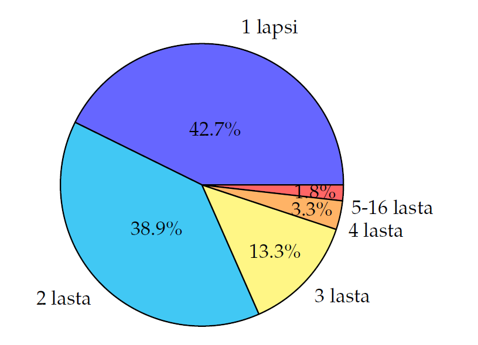

* content
{:toc}

## Luvun tavoitteet
Tämän luvun tavoitteena on, että pystyt xxxx. Osaat
* xxxxx
* xxxxx
* xxxxx
* xxxxx
* xxxxx
* xxxxx
* xxxxx

## Frekvenssi
Kiinnistava aloitus tilastojen merkityksestä yhteiskunnassa esim. korona.

Tässä luvussa tutkitaan Suomessa asuvia lapsiperheitä, joissa on alle 18-vuotiaita lapsia. Lapsiperheitä koskevat tiedot on poimittu <a href="https://www.stat.fi/">Tilastokeskuksen sivulta</a>. Tämä lähestyminen seuraa [kevään 2020 lyhyen matematiikan ylioppilaskokeen tehtävää 6](http://yle.fi/plus/abitreenit/2020/kevat/2020-03-18_N_fi/index.html#6>).

Tutkimista varten määritellään muutamia tilastotieteen keskeisiä käsitteitä.



Tässä tutkittava joukko on Suomessa asuvat lapsiperheet, joissa on alle 18-vuotiaita lapsia. Jokainen perhe on havaintoyksikkö ja perheen alle 18-vuotiaiden lasten lukumäärä on havaintoarvo. 
  
{% include box.html  
type="exercise"
header="Havaintoyksikkö ja havaintoarvo: kotipihan linnut" 
content="
Aleksanteri tutkii kotipihallaan pesivien lintujen linnunpönttöjen asukkaat. Niissä pesii sinitiainen, kirjosieppo, sinitiainen, kirjosieppo, punarinta ja sinitiainen.
1. Mikä Aleksanterin tutkimuksessa on havaintoyksikkö? 
1. Mikä Aleksanterin tutkimuksessa on havaintoarvo?
" 
extra="
1. Linnunpöntöt ovat havaintoyksiköitä, niitä on kuusi kappaletta. 
1. Jokaiseen havaintoyksikköön liittyy suure, joka on linnun laji. Linnun laji on siis havaintoarvo.
" %}
  
  

Tässä moduulissa tutustutaan vain tilanteisiin, joissa havaintoarvoja on äärellinen määrä tai joissa havaintoarvot voidaan numeroida luonnollisilla luvuilla. Tällaisia tilanteita kutsutaan *diskreeteiksi*. Jos tutkittava ominaisuus voi saada mitä tahansa reaalilukuarvoja jollakin välillä, kuten koulun oppilaiden pituudet, ei kyse ole diskreetistä tilanteesta. Näitä tilanteita tutkitaan moduulissa MAA12.
               
Jos joukossa on vähän havaintoyksiköitä, niin havaintoarvot voi esittää luettelemalle ne peräkkäin. Jos havaintoyksiköitä on paljon, niin havaintoarvojen luetteleminen on epäkäytännöllistä ja epähavainnollista. Tällöin havaintoyksiköt pitää *luokitella*. Luokittelussa lasketaan, kuinka moni havaintoyksikkö vastaa kutakin havaintoarvoa. Jos havaintoarvoja on hyvin paljon, täytyy ne ensin luokitella sopiviin luokkiin ennen havaintoyksikköjen laskemista.

Lapsiperheiden luokittelussa lasketaan, kuinka monessa perheessä, eli havaintoyksikössä, on yksi lapsi (havaintoarvo 1), kuinka monessa on kaksi lasta (havaintoarvo 2), jne. Tiedot on koottu alla olevaan taulukoon:
                
| Lasten lkm| $f$ 	|
| ---		| ---	|
| 1			| 241709|
| 2			| 220116| 			
| 3			| 75326	| 
| 4			| 18409	| 
| 5			| 5493	| 
| 6			| 2289	| 
| 7			| 1235	| 
| 8			| 751	| 
| 9			| 476	| 
| 10		| 262	| 
| 11		| 117	| 
| 12		| 41	| 
| 13		| 12	| 
| 14		| 3		| 
| 15		| 0		| 
| 16		| 3		| 
| **Yhteensä**	| **566242**| 
			
Yllä olevassa taulukossa ensimmäinen sarake "Lasten lkm" vastaa aineiston eri havaintoarvoja. Toinen sarake $f$ taas kertoo perheiden lukumäärän. Luku 15 ei ole havaintoarvo, koska missään perheessä ei ole 15 lasta. Se vaikuttaa mahdolliselta havainnolta, koska suurempiakin perheitä on olemassa. Sanotaan, että luku 15 on *mahdollinen havaintoarvo*, ja se otetaan tämän takia mukaan.

Lasten lukumääränä  17 myös on mahdollinen havaintoarvo; huomaa, että nolla ei ole mahdollinen havaintoarvo, koska tutkitaan perheitä, joissa on lapsia. Luokittelussa lapsiperheisiin liittyvät mahdolliset havaintoarvot rajataan ottamalla mukaan vain kaikki mahdollisuudet pienimmän havaintoarvon ja suurimman havaintoarvon väliltä.
				
	

{% include box.html  
type="exercise"
header="Mahdollinen havaintoarvo: kotipihan linnut (jatkoa)" 
content="
Aleksanteri jatkaa linnunpönttöjen tutkimista tutkimalla myös naapurien linnunpöntöt.
1. Anna esimerkki lintulajista, joka on mielekäs mahdollinen havaintoarvo.
1. Anna esimerkki lintulajista, joka ei ole mielekäs mahdollinen havaintoarvo.
" 
extra="
1. Kaikki havaintoarvot ovat mahdollisia havaintoarvoja, joten Aleksanterin pihan lintulajit (havaintoarvot) kelpaavat vastaukseksi. Myös esimerkiksi talitiainen on mielekäs mahdollinen havaintoarvo.                                
1. Strutsi, koska se ei pesi pöntössä.
" %}
						
Luku, joka kertoo, kuinka moni havaintoyksikkö liittyy havaintoarvoon, on *frekvenssi*. 

Yllä olevasta taulukosta nähdään esimerkiksi, että havaintoarvon 10 frekvenssi on 262, eli kymmenlapsisia perheitä on Suomessa 262 kappaletta. Jos mahdollinen havaintoarvo ei ole havaintoarvo, niin siihen ei liity yhtään havaintoyksikköä, joten sen frekvenssi on nolla.
					
{% include box.html  
type="definition"
header="Frekvenssi ja suhteellinen frekvenssi" 
content="
Mahdollisen havaintoarvon *frekvenssi* on  sitä vastaavien havaintoyksiköiden lukumäärä. Frekvenssiä merkitään yleensä kirjaimella $f$.

Mahdollisen havaintoarvon *suhteellinen frekvenssi* on sen havaintoyksiköiden osuus kaikista havaintoyksiköistä.	Suhteellista frekvenssiä merkitään yleensä symbolilla $f$ %. 
" %}	

Esimerkiksi voidaan laskea, että kolmilapsisia perheitä on Suomessa $\frac{75326}{566242}=0{,}1330\ldots\approx 13{,}3$ %, joten havaintoarvon 3 suhteellinen frekvenssi on $13{,}3$ %.
	
{% include box.html  
type="exercise"
header="Suhteellinen frekvenssi ja teknisen apuvälineen käyttö: Suomen lapsiperheet" 
content="
Tehtävänä on täydentää taulukkoon suhteelliset frekvenssit.

| Lasten lkm| $f$ 	|
| ---		| ---	|
| 1			| 241709|
| 2			| 220116| 			
| 3			| 75326	| 
| 4			| 18409	| 
| 5			| 5493	| 
| 6			| 2289	| 
| 7			| 1235	| 
| 8			| 751	| 
| 9			| 476	| 
| 10		| 262	| 
| 11		| 117	| 
| 12		| 41	| 
| 13		| 12	| 
| 14		| 3		| 
| 15		| 0		| 
| 16		| 3		| 
| **Yhteensä**	| **566242**|

1. Laske yksilapsisten perheiden osuus kaikista perheistä, eli havaintoarvon 1 suhteellinen frekvenssi.
1. Kopioi taulukko  maalaamalla solut ja liitä tiedot taulukkolaskentaohjelmaan, esimerkiksi LibreOffice Calc- ohjelmaan. 
1. Syötä suhteellisen frekvenssin sarakkeeseen havaintoarvoa 1 vastaavalle riville a-kohdan lausekkeesi kaavana. Jos luku 241709 on solussa B1, niin kirjoita viereiseen soluun `=B1/566242*100` ja paina enter. 		
1. Kopioi kaava jokaiseen havaintoarvoon tarttumalla edellisen kohdan solun oikeasta alakulmasta kiinni ja maalaamalla sarake Yhteensä-riville asti. 	
1. Tarkista vastauksesta, saitko tehtyä samanlaisen taulukon.										
" 
extra="
1. Koska tilastossa on lapsiperheitä yhteensä 566242 kappaletta, niin yksilapsisten perheiden osuus kaikista aineiston perheistä on 
					$$\frac{241709}{566242}\approx 42,7\ \%.$$                
1. Taulukkolaskentaohjelman avulla saadaan seuraava taulukko:

| Lasten lkm| $f$ 	| $f$ %	|	 
| ---		| ---	| ---	|
| 1			| 241709| 42,7 %|
| 2			| 220116| 38,9 %|		
| 3			| 75326	| 13,3 %|
| 4			| 18409	| 3,3 %	|
| 5			| 5493	| 1,0 %	|
| 6			| 2289	| 0,4 %	|
| 7			| 1235	| 0,2 %	|
| 8			| 751	| 0,1 %	|
| 9			| 476	| 0,08 %|
| 10		| 262	| 0,05 %|
| 11		| 117	| 0,03 %|
| 12		| 41	| 0,007 %|
| 13		| 12	| 0,002 %|
| 14		| 3		| 0,0005 %|
| 15		| 0		| 0 %	|
| 16		| 3		| 0,0005 %|
| **Yhteensä**	| **566242**| 100 % |
" %}	

Mahdollisten havaintoarvojen ja suhteellisten frekvenssien muodostamaa kokonaisuutta kutsutaan *jakaumaksi*. Jakaumiin tutustutaan tarkemmin luvussa [jakaumat]. 

{% include box.html  
type="exercise"
header="Frekvenssi ja suhteellinen frekvenssi: kotipihan linnut (jatkoa)" 
content="
Aleksin kotipihalla pesii sinitiainen, kirjosieppo, sinitiainen, kirjosieppo, punarinta ja sinitiainen. Kerää lintulajien frekvenssit ja suhteelliset frekvenssit taulukkoon.
" 
extra="
| Havaintoarvo	| $f$ 	| $f$ %	|	 
| ---			| ---	| ---	|
| punarinta		| 1		| $\frac{1}{6}\approx 16,7\ \%$|
| kirjosieppo	| 2		| $\frac{2}{6}\approx 33,3\ \%$|		
| sinitiainen	| 3		| $\frac{3}{6}=50\ \%$|
| **Yhteensä**	| 6		| 100 %	|
" %}

Summafrekvenssi ja suhteellinen summafrekvenssi???	

## Keskiluvut

Aineistoja tutkittaessa mielenkiinnon kohteena on usein löytää aineiston "tyypillisin" tai "keskimmäisin" tapaus. Tätä kuvaamaan käytetään erilaisia keskilukuja. Niiden määrittämisen mielekkyys riippuu havaintoarvojen luonteesta, eli siitä mitä on mielekästä kutsua "tyypilliseksi" kyseisessä aineistossa.

Yksi keskiluku on aineiston yleisin havaintoarvo. Lapsiperheitä tutkiessa huomattiin, että  yksilapsisia perheitä on havaintoyksiköistä kaikkein eniten. Tilastotieteessä yleisintä havaintoarvoa kutsutaan *moodiksi*.



Havaintoarvot noudattavat *luokitteluasteikkoa*, jos  arvot voidaan ainoastaan luokitella, mutta niitä ei voi asettaa suuruusjärjestykseen. Tällaisia  ovat esimerkiksi silmien väri, sukupuoli, asuinkunta jne.
				


Havaintoarvot noudattavat *järjestysasteikkoa*, jos  arvot voidaan asettaa suuruusjärjestykseen. Tälläisiä ovat esimerkiksi sotilasarvo tai ylioppilastutkinnon arvosanat (I, A, ..., E, L). Peruslaskutoimitukset eivät ole sallittuja (numeerisella) järjestysasteikolla, koska luokkien väliset etäisyydet voivat olla erisuuria.

{% include box.html  
type="exercise"
header="Järjestysasteikko" 
content="
Ylioppilastutkinnossa arvosanat rinnastetaan lukuihin seuraavasti: I vastaa lukua 0, A vastaa lukua 2, B vastaa lukua 3, ...,  E vastaa lukua 6 ja L vastaa lukua 7.  Ajatellaan seuraavaa tilannetta:
1. \"Maija ja Matti kävivät uusimassa matematiikan ylioppilaskokeen. Maija sai korotettua arvosanasta I arvosanaan B ja Matti arvosanasta M arvosanaan L.\"
1. Voidaanko tästä päätellä, että Maijan parannus on suurempi kuin Matin? Perustele.
" 
extra="
Ei voida, koska emme tunne eri havaintoarvojen välisiä etäisyyksiä. Maijan arvosanan parannus 3 ei kuvaa arvosanojen I ja B välistä etäisyyttää, kuten ei myöskään Matin arvosanan parannus 2 arvosanojen M ja L välistä etäisyyttä. Koska luvut eivät kuvaa etäisyyksiä, niin niitä ei voi verrata. 						
" %}	

Järjestysasteikolla havaintoarvoille voidaan määrittää moodin lisäksi mediaani.

		

	

Kirjoittamalla lapsiperhe-esimerkissä kaikki havaintoarvot eli kaikkien perheiden lasten lukumäärät peräkkäin suuruusjärjestykseen saamme:

$${\tiny
					
						\underbrace{1, \ldots, 1}_{241\,709\text{kpl}}, \underbrace{2, \ldots, 2}_{220\,116\text{kpl}},
						\underbrace{3, \ldots, 3}_{75\,326\text{kpl}}, \underbrace{4, \ldots, 4}_{18\,409\text{kpl}},
						\underbrace{5, \ldots, 5}_{5\,493\text{kpl}}, \underbrace{6, \ldots, 6}_{2\,289\text{kpl}},
						\underbrace{7, \ldots, 7}_{1\,235\text{kpl}}, \underbrace{8, \ldots, 8}_{751\text{kpl}},
						\underbrace{9, \ldots, 9}_{476\text{kpl}}, \underbrace{10, \ldots, 10}_{262\text{kpl}},
						\underbrace{11, \ldots, 11}_{117\text{kpl}}, \underbrace{12, \ldots, 12}_{41\text{kpl}},
						\underbrace{13, \ldots, 13}_{12\text{kpl}}, 14, 14, 14, 16, 16, 16.
						
}$$

Tässä on yhteensä 566242 lukua, joka on parillinen määrä. Näin ollen keskimmäistä lukua ei ole. Ensimmäisen puolikkaan viimeinen luku on 2, kuten myös toisen puolikkaan ensimmäinen luku. Mediaani on siis 2.
					
{% include box.html  
type="exercise"
header="Suhteellinen frekvenssi ja mediaani" 
content="
Laske alla olevaan taulukkoon suhteelliset frekvenssit. Pystyykö pelkistä suhteellisista frekvensseistä määrittämään mediaanin?

| **Arvosana**	| 4	| 5	| 6	| 7	| 8	| 9	| 10	|
| **Lkm**		| 1	| 0	| 3	| 1	| 2	| 1	| 2		|
|	$f$ %		|	|	|	|	|	|	|		|							

" 
extra="
" %}

Havaintoarvot noudattavat *välimatka-asteikkoa*, jos arvojen erotus on mielekkäästi tulkittavissa. Tällaisia  ovat esimerkiksi kouluarvosana, vuosiluku, jne. 
				
Esimerkiksi mineraalien luokittelussa ja tunnistamisessa käytetään kovuutta kuvaava Mohsin asteikkoa. Se on esimerkki järjestysasteikosta, joka ei ole välimatka-asteikko. Tämä käy ilmi seuraavasta lainauksesta:

> "Mineraalit on jaettu kymmeneen kovuusluokkaan ns. Mohsin kovuusasteikon mukaan. Asteikossa ylemmän luokan mineraalilla kyetään naarmuttamaan alemman luokan mineraalia. [...] Asteikko ei ole läheskään tasavälinen, minkä paljastaa mineraalien todellisia kovuuksia kuvaava ns. Rosiwallin asteikko."
*Kalle Taipale: Kivet ja mineraalit Suomen luonnossa, Otava, 2010, s. 78.*



Välimatka-asteikolla voi laskea moodin ja mediaanin lisäksi keskiarvon. 

	



Tutkitaan lapsiperhe-esimerkin lasten lukumäärän (aritmeettista) keskiarvoa. Lasketaan lasten lukumäärä kertomalla ensin lasten lukumäärät niiden frekvensseillä ja laskemalla sitten saadut luvut yhteen: 
					$$
						\begin{split}
						&241\,709 \cdot 1 + 220\,116 \cdot 2 + 75\,326 \cdot 3 + 18\,409 \cdot 4 + 5\,493 \cdot 5 + 2\,289 \cdot 6
						+  1\,235 \cdot 7 + 752 \cdot 8\\
						&\quad + 476 \cdot 9
						+ 262 \cdot 10 + 117 \cdot 11 + 41 \cdot 12 + 12 \cdot 13 + 3 \cdot 14 +0 \cdot 15 + 3 \cdot 16
						=1\,046\,336
						\end{split}
					$$
					ja jaetaan se perheiden lukumäärällä
					$$
						\frac{1\,046\,336}{566\,242}\approx 1{,}85.
					$$
Näin ollen lapsiperheiden lasten lukumäärän keskiarvo on noin 1,85. 



Huomaa, että lapsiperhe-esimerkissä moodi, keskiarvo ja mediaani ovat kaikki eri lukuja. Ne voivat olla kaikki samoja, kaksi on samoja ja yksi on eri tai kaikki eri lukuja.
				
	



Huomaa, että järjestysasteikossa havaintoarvot voidaan samaistaa mihin tahansa kasvavaan kokoelmaan lukuja. Samaistuksen jälkeen keskiarvon tekninen laskeminen on mahdollista, mutta saatu tulos ei välttämättä kerro mitään alkuperäisestä tilanteesta, kuten seuraavassa esimerkissä. 
				
Olisiko seuraavat tehtävät TSII? 

{% include box.html  
type="exercise"
header="Asteikot" 
content="
Aleksanteri on lähdössä Kemijärveltä maastopyörävaellukselle. Hän luokittelee kiinnostavat kohteet kolmeen luokkaan: luokassa 1 etäisyys Kemijärveltä on alle 50 km, luokassa 2 etäisyys Kemijärveltä on  50-150 km, luokassa 3 etäisyys Kemijärveltä on  yli 150 km. 
				
Nyt havintoyksikköinä ovat paikat ja havaintoarvoina numerot 1, 2 ja 3. Havaintoarvot muodostavat järjestysasteikon, mutta eivät välimatka-asteikkoa. Miksi?
" 
extra="
Esimerkiksi Savukosken kuntakeskus kuuluu luokkaan 2 ja Kemihaara luokkaan 3. Nyt Kemihaaran ja Savukosken kuntakeskuksen luokkien erotuksella  $3-2 =1$ ei ole järkevää tulkintaa.  Siitä ei esimerkiksi voi päätellä mitään Kemihaaran ja Savukosken kuntakeskuksen välisestä etäisyydestä. Myöskään luokkien keskiarvolla $\frac{2+3}{2}= \frac52$ ei ole järkevää tulkintaa. 							
" %}		

		



## Keskihajonta

Eri havaintoarvojen joukoilla voi olla sama keskiarvo, esimerkiksi silloin, kun joukot ovat 5, 7, 9 ja 7, 7, 7. Keskiarvo ei siis kerro, miten  havaintoarvot ovat jakautuneet. Tutustumme tässä luvussa *keskihajontaan*., joka  kuvaa havaintoarvojen jakautumista keskiarvon ympärille. Tässä luvussa ajattelemme, että meillä on käytössä välimatka-asteikko, jolloin voimme laskea havaintoarvojen erotuksia.



Alla olevassa taulukossa on Tuulian ja Lukan koearvosanoja. Molemmilla on sama keskiarvo 8, sama vaihteluväli  $[6, 10]$ ja sama vaihteluvälin pituus $10-6=4$, mutta siitä huolimatta näyttää siltä, että Tuulian arvosanoissa on enemmän vaihtelua. 

| **Arvosana**		| 4	| 5 | 6 | 7 | 8	| 9	| 10	|
| **Tuulia (lkm %)**| 0 | 0 | 3	| 0	| 1	| 0 | 3		|
| **Luka (lkm %)**	| 0	| 0	| 1	| 1	| 3	| 1	| 1		|

	

Jatketaan Tuulian ja Lukan koearvosanojoen analysointia ja lasketaan Tuulian ja Lukan koearvosanojen keskihajonta, yllä olevan taulukon tiedoilla. Molempien koearvosanojen keskiarvo on 8.  Tuulian koearvosanojen keskihajonta on
		
$$
						\begin{split}
						&\sqrt{\frac{1}{7}\left( (6-8)^2+ (6-8)^2 +(6-8)^2 + (8-8)^2 + (10-8)^2+ (10-8)^2+ (10-8)^2\right)}\\
						&= \sqrt{\frac{1}{7}\left(4+4+4+0+4+4+4\right)} \approx 1{,}9
						\end{split}
						$$
ja Lukan koearvosanojen keskihajonta on
						$$
						\begin{split}
						&\sqrt{\frac{1}{7}\left((6-8)^2+ (7-8)^2 +(8-8)^2 + (8-8)^2 + (8-8)^2+ (9-8)^2+ (10-8)^2\right)}\\
						&= \sqrt{\frac{1}{7}\left(4+1+0+0+0+1+4\right)} \approx 1{,}2. 
						\end{split}
						$$
Kuten aiemmin jo huomattiin, Tuulian koearvosanoissa on enemmän vaihtelua kuin Lukan.  
					




## Diagrammit

Diagrammeilla voidaan havainnollistaa ja konkretisoida havaintoaineistoja. Pylväsdiagrammi sopii esimerkiksi absoluuttisten määrien esittämiseen, kun taas ympyrädiagrammi havainnollistaa hyvin suhteita. Diagrammin tyyppiä valitessa tulee kiinnittää erityistä huomiota siihen, että diagrammi havainnollistaa haluttua asiaa. 

Alla olevissa diagrammeissa on esitetty lapsiperheiden kokonaismäärä ja suhteellinen osuus:

    

              
             
					